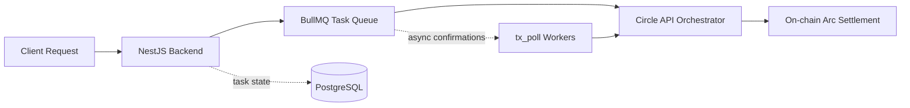

# WizPay Core

## Task-based execution engine for batched USDC payroll.

WizPay Core is an institutional-grade monorepo for high-velocity stablecoin payroll on Arc. It combines a NestJS orchestration layer, BullMQ-backed task execution, Circle Programmable Wallets, and Arc settlement contracts to move USDC with deterministic task state, auditable retries, and low operational overhead.

The repository is organized for operators who need predictable execution semantics and for ecosystem partners who need a transparent, reviewable payment stack across API orchestration, queueing, and on-chain settlement.

## Why WizPay?

- Idempotency: task execution is modeled as a deterministic state machine from `created` to terminal status, with BullMQ retries guarded by backend status checks so duplicate job delivery does not create duplicate payroll effects.
- Low Latency: payroll initiation validates payloads up front, queues execution immediately, and hands off long-tail confirmation work to the `tx_poll` queue so workers stay available for the next batch.
- Cost-Efficiency: operators can batch validation, amortize queue overhead across many recipients, and use atomic on-chain payout routes in the contracts package when a single transaction is the right settlement primitive.

## Architecture



### Execution Layers

| Layer | Responsibility | Primary Stack |
| --- | --- | --- |
| Request ingestion | Validate payroll, swap, bridge, and liquidity intents | Next.js, NestJS, class-validator |
| Deterministic orchestration | Persist task state, enqueue jobs, enforce idempotency | NestJS, BullMQ, Redis, Prisma |
| Circle execution | Create transfers, wallet operations, FX trades, and bridge flows | Circle Programmable Wallets, Circle APIs |
| Settlement | Execute recipient-facing transfers or atomic on-chain batch routes | Arc Network, WizPay contracts |

## Core Features

- Deterministic execution state machine: the backend models every payment as a task with explicit status transitions, unit accounting, append-only logs, and retry-safe worker semantics.
- Atomic batch settlement: the contracts package exposes `batchRouteAndPay` for same-output and mixed-output atomic settlement paths when payroll flows need one-transaction finality.
- Arc-native execution surface: the platform is built around Arc settlement constraints and Arc-connected gateway and bridge flows rather than retrofitting generic EVM payout assumptions.
- Circle-first orchestration: Circle Programmable Wallets and related Circle APIs are first-class execution adapters, not an afterthought integration.
- Audit-ready contracts: public and external Solidity entrypoints are documented with NatSpec, revert strings have been refactored to custom errors, and critical liquidity and routing paths now follow clearer checks-effects-interactions ordering.

## Repository Layout

```text
apps/
	backend/      NestJS task orchestrator, queue workers, Circle adapters
	frontend/     Next.js operator console and execution surfaces
	landing/      Vite marketing site
packages/
	contracts/    Foundry contracts, deployment scripts, Solidity tests
docs/           Architecture, execution flow, and task-system documentation
```

## Quick Start

### Prerequisites

- Node.js 22+
- npm 10+
- Docker and Docker Compose
- Foundry for Solidity compilation and tests

### Environment

Use the root `.env.example` as the source of truth for shared configuration.

- Root `.env`: primary source for Docker Compose, backend local runs, and frontend local runs.
- `apps/backend/.env`: not used as the default development path.
- `apps/frontend/.env.local`: optional, not the primary configuration path.
- `apps/frontend/.env.docker`: legacy helper for local container flows.

### Install

```bash
npm install
```

### Run The Stack

```bash
npm run dev:stack
```

### Run Individual Workspaces

```bash
npm run dev:backend
npm run dev:frontend
npm run dev:landing
```

### Build And Test

```bash
npm run build
npm run test
npm run test:backend
npm run test:contracts
```

## Operational Model

WizPay supports synchronous and asynchronous execution models depending on the payment primitive.

- Payroll tasks are queued, executed, and reconciled asynchronously through `tx_poll` so a high-recipient run does not monopolize worker capacity.
- FX, swap, bridge, and liquidity paths flow through the same task model, which preserves a single audit surface across Circle-mediated execution and contract-mediated settlement.
- On-chain batch payouts remain atomic when routed through the contracts package, which is useful for treasury flows that prefer single-transaction settlement guarantees.

## Contracts And Security

The contracts workspace focuses on non-custodial routing and liquidity execution for Arc-compatible stablecoin flows.

- `WizPay.sol` implements fee-aware single and batch payment routing with pause controls, whitelist enforcement, and deterministic event emission.
- `StableFXAdapter_V2.sol` provides liquidity-backed FX routing with accepted-asset controls, rate staleness checks, and reentrancy protection on external liquidity and swap entrypoints.
- Foundry tests cover router behavior and adapter liquidity flows, including accepted-token enforcement and fee-adjusted output verification.

Run the Solidity suite directly with:

```bash
cd packages/contracts
forge test
```

## Contributing

Contributions are welcome from protocol engineers, integrators, and community contributors who want to improve the execution engine, operator experience, or contract security posture.

1. Open an issue or design note before large behavioral changes, especially anything that alters task semantics, Circle execution assumptions, or settlement guarantees.
2. Keep changes scoped to a single concern and include tests for queue behavior, API behavior, or contract behavior as appropriate.
3. Update relevant docs in `docs/` when changing orchestration, state transitions, task payloads, or contract interfaces.
4. Treat security-sensitive findings as private disclosures to the repository maintainers rather than public issues.

For Circle-facing or ecosystem-facing changes, maintain explicit idempotency guarantees, observable audit logs, and production-safe rollback paths.

## License

MIT. See [LICENSE](LICENSE) for details.
