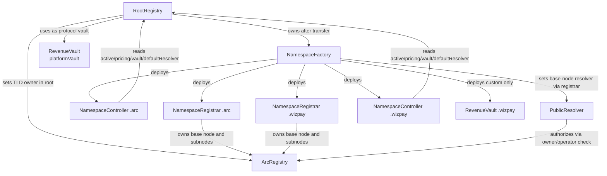
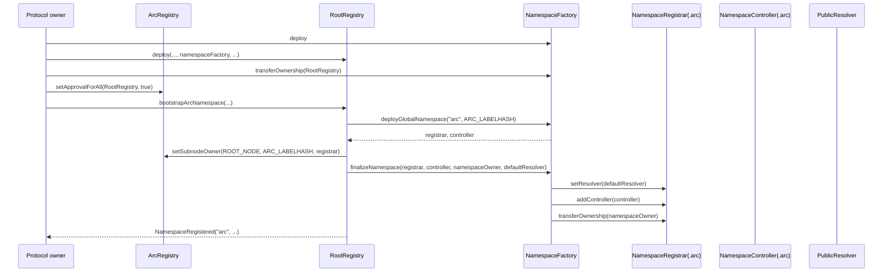
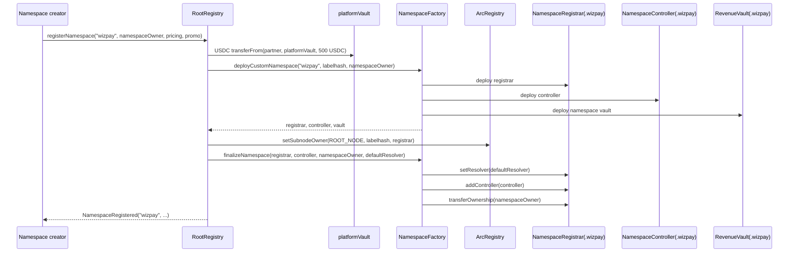
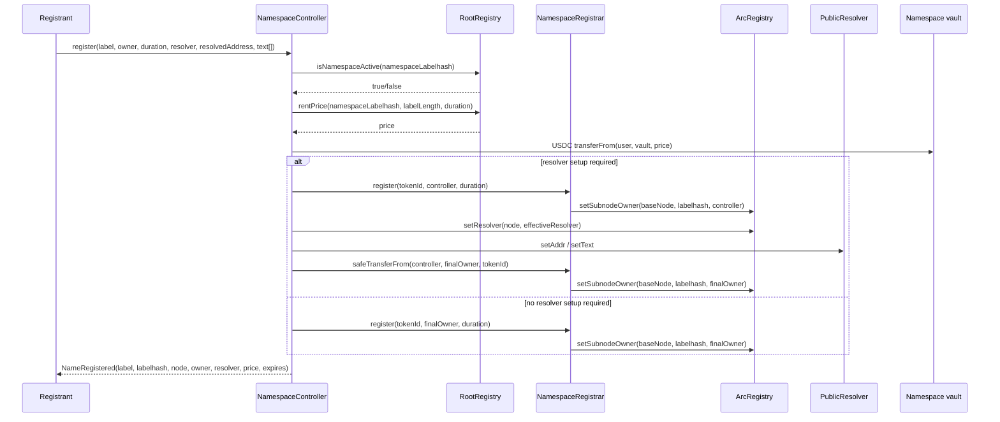
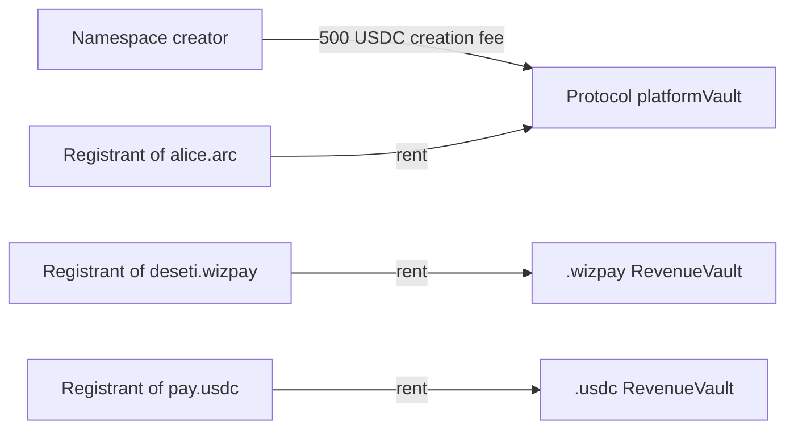
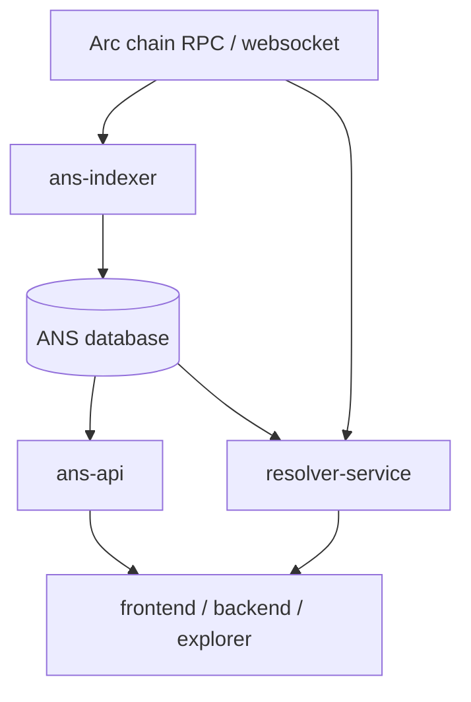
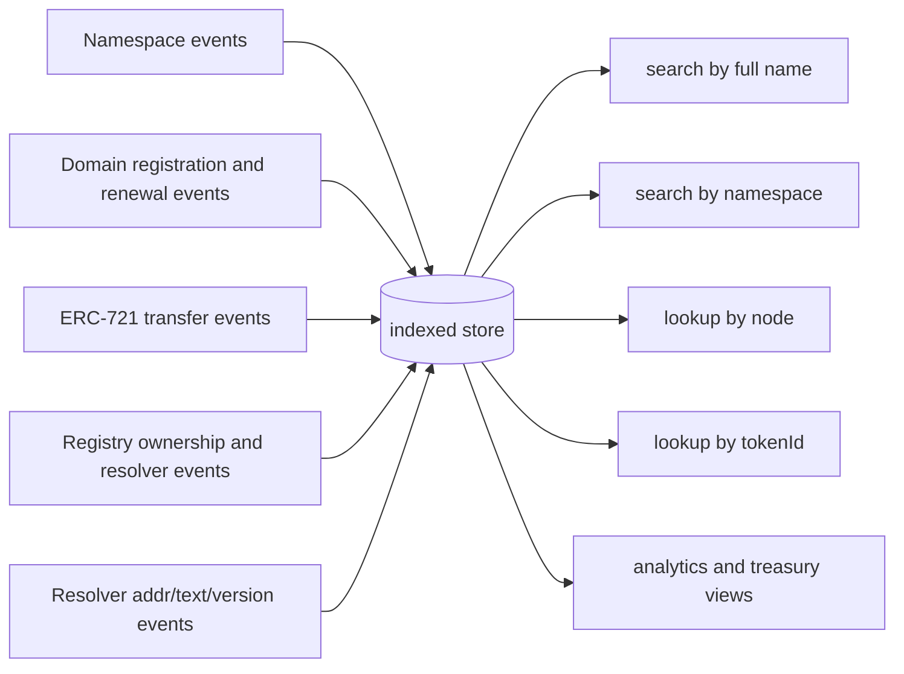

# ANS Protocol Architecture

This document describes the ANS implementation that currently exists in this monorepo. It treats the deployed contracts, deployment script, ANS test suite, and current backend resolver module as the source of truth.

Implementation sources used for this document:

- `packages/contracts/src/ans/*.sol`
- `packages/contracts/script/DeployANS.s.sol`
- `packages/contracts/test/ANS.t.sol`
- `apps/backend/src/ans/*`
- `apps/backend/src/agents/payroll/payroll-validation.service.ts`
- `.env.example`

Sections labeled `Implemented` describe behavior that exists today. Sections labeled `Planned` describe recommended production architecture that is not yet implemented in this monorepo.

## 1. Protocol Overview

### Purpose of ANS

ANS, the Arc Name Service, is an ENS-style naming system built around Arc EVM infrastructure. Its purpose is to provide:

- human-readable names such as `alice.arc` and `deseti.wizpay`
- namespace-level sovereignty for partners
- per-namespace pricing and promotional economics
- isolated treasury routing for protocol revenue and partner revenue
- on-chain ownership of second-level labels through ERC-721 registrars

ANS is not implemented as a single monolithic registrar. Instead, it uses a root control plane plus independently deployed per-namespace registrar/controller stacks.

### Sovereign Namespace Model

Implemented behavior:

- `.arc` is the protocol's global namespace
- each custom namespace such as `.wizpay`, `.usdc`, or `.dao` is created independently through `RootRegistry.registerNamespace(...)`
- every custom namespace gets its own:
  - `NamespaceRegistrar`
  - `NamespaceController`
  - `RevenueVault`
- registrar ownership is transferred to the namespace owner after bootstrap
- the namespace owner can later add extra controllers and rotate treasury routing without affecting other namespaces

This creates strict namespace isolation at the registrar, controller, and treasury layers.

### Relationship Between `.arc` and Custom Namespaces

Implemented behavior:

- `.arc` is bootstrapped by protocol governance through `bootstrapArcNamespace(...)`
- `.arc` does not deploy a dedicated namespace vault; it routes revenue to the protocol `platformVault`
- custom namespaces are created by paying a one-time namespace creation fee of `500 USDC`
- custom namespaces do deploy their own dedicated `RevenueVault`

Operationally, `.arc` is the protocol-owned global namespace, while `.wizpay` and other custom namespaces are sovereign partner namespaces governed through the same root control plane but monetized independently.

### Namespace Hierarchy

```mermaid
flowchart TD
    Root[ArcRegistry root node 0x0]
    RR[RootRegistry]\ncontrol plane
    ARC[.arc namespace]\nprotocol-global
    WIZ[.wizpay namespace]\npartner-sovereign
    USDC[.usdc namespace]\npartner-sovereign
    A1[alice.arc]
    W1[deseti.wizpay]
    U1[payments.usdc]

    Root --> ARC
    Root --> WIZ
    Root --> USDC
    RR -. governs namespace metadata .-> ARC
    RR -. governs namespace metadata .-> WIZ
    RR -. governs namespace metadata .-> USDC
    ARC --> A1
    WIZ --> W1
    USDC --> U1
```

## 2. Core Contracts

### Contract Relationship Diagram



### Contract Responsibilities

| Contract | Implemented responsibility | Key trust boundary |
|---|---|---|
| `RootRegistry` | Global ANS control plane. Stores namespace owner, registrar, controller, vault, active state, promo config, pricing tiers, blacklist/whitelist flags, and protocol-wide default resolver/platform vault. | Protocol owner governs `.arc`, namespace activation, blacklist state, resolver default, platform vault, and can override partner config. |
| `ArcRegistry` | EIP-137 style registry for node ownership, resolver pointers, TTL, and operator approvals. | Does not understand namespaces semantically. It only stores ownership and resolver state keyed by namehash-like nodes. |
| `NamespaceFactory` | Deploys namespace registrar/controller pairs and custom namespace vaults; finalizes wiring by setting registrar base-node resolver, adding the controller, and transferring registrar ownership. | Must be owned by `RootRegistry` to avoid arbitrary namespace stack deployment. |
| `NamespaceRegistrar` | ERC-721 registrar for one namespace. Stores expiry, grace period behavior, controller allowlist, and mirrors subnode ownership into `ArcRegistry`. | Once ownership is transferred, the namespace owner controls controllers and base-node resolver for that namespace only. |
| `NamespaceController` | Registration and renewal entry point for one namespace. Validates labels, computes price through `RootRegistry`, routes payment to the namespace vault, and optionally assigns resolver records. | Can only mint and renew inside its registrar's base node. Cannot affect other namespaces. |
| `RevenueVault` | Generic isolated treasury vault used both as the protocol treasury and custom namespace treasury primitive. | Each vault is independently owned. Withdrawing from one vault gives no authority over any other vault. |
| `PublicResolver` | Stores forward `addr()` records and text metadata with versioned clearing semantics. | Mutations require ownership or registry operator approval on the target node. |

### RootRegistry

Implemented responsibilities:

- bootstraps `.arc`
- registers custom namespaces
- stores `NamespaceRecord`, `PricingConfig`, and `PromoConfig`
- computes rent through `rentPrice(...)`
- enforces reserved namespace protection for `arc`, `root`, `admin`, and `www`
- tracks whether a namespace is global, active, whitelisted, and blacklisted
- routes `.arc` revenue to `platformVault`
- routes custom namespace revenue to the namespace-specific vault stored in the namespace record

Important implemented governance semantics:

- `.arc` pricing and promo can only be updated by the `RootRegistry` owner
- custom namespace pricing and promo can be updated by the namespace owner or the `RootRegistry` owner
- custom namespace vault can be rotated by the namespace owner or the `RootRegistry` owner
- `.arc` vault cannot be rotated through `setNamespaceVault(...)`; it uses `setPlatformVault(...)`

Important implemented nuance:

- `whitelisted` is persisted and emitted, but the current on-chain registration path does not consume it in `isNamespaceActive(...)`
- on-chain registration gating currently depends on `owner != 0`, `active == true`, and `blacklisted == false`

### ArcRegistry

Implemented responsibilities:

- stores node owner, resolver, and TTL
- stores operator approvals through `setApprovalForAll(...)`
- authorizes `setOwner`, `setResolver`, `setTTL`, `setSubnodeOwner`, `setRecord`, and `setSubnodeRecord`

Deployment prerequisite:

- the root owner must approve `RootRegistry` as an operator on the root node before `RootRegistry` can call `setSubnodeOwner(ROOT_NODE, ...)` for `.arc` or any custom namespace

This approval step is part of the live deployment flow.

### NamespaceFactory

Implemented responsibilities:

- `deployGlobalNamespace(...)` deploys a registrar/controller pair for `.arc`
- `deployCustomNamespace(...)` deploys a registrar/controller pair plus a dedicated `RevenueVault`
- `finalizeNamespace(...)` performs the post-deploy wiring:
  - sets the registrar base-node resolver
  - authorizes the controller in the registrar
  - transfers registrar ownership to the namespace owner

Important indexing note:

- the factory emits no events
- indexers should use `RootRegistry.NamespaceRegistered` as the authoritative namespace deployment event

### NamespaceRegistrar

Implemented responsibilities:

- represents second-level domains as ERC-721 tokens
- keeps one expiry timestamp per hashed label
- exposes a controller allowlist
- defines a `GRACE_PERIOD` of `90 days`
- mirrors subnode ownership into `ArcRegistry` inside `_update(...)`

Important implemented semantics:

- `ownerOf(tokenId)` reverts after expiry, even before the grace period fully ends
- `available(tokenId)` becomes `true` only when `expiry == 0` or `expiry + GRACE_PERIOD < block.timestamp`
- `renew(...)` is allowed only while the name is still within its renewable window: `expiry != 0` and `expiry + GRACE_PERIOD >= block.timestamp`

This creates a three-stage lifecycle:

1. live: owner exists and normal ERC-721 ownership works
2. expired but inside grace period: `ownerOf` no longer works, but the name is still not re-registrable and can still be renewed
3. post-grace: name becomes available for a fresh registration

### NamespaceController

Implemented responsibilities:

- validates second-level labels
- computes `tokenId = uint256(keccak256(bytes(label)))`
- computes domain node as `keccak256(abi.encodePacked(baseNode, keccak256(bytes(label))))`
- pulls rent from `RootRegistry.rentPrice(...)`
- transfers USDC directly from the caller to the namespace vault
- performs registration and renewal against its namespace registrar
- optionally assigns resolver/address/text records during registration

Important implemented resolver behavior:

- if no resolver, no resolved address, and no text records are supplied, the controller does not assign a resolver to the new domain node
- if resolver-related data is supplied and `resolverAddress == 0`, the controller falls back to `RootRegistry.defaultResolver()`
- if resolver-related data is supplied, the controller temporarily registers the name to itself, writes resolver data, then transfers the ERC-721 token to the final owner

### RevenueVault and Platform Revenue Vault

Implemented behavior:

- there is only one treasury contract type: `RevenueVault`
- the protocol treasury is a `RevenueVault` instance stored in `RootRegistry.platformVault`
- the `.arc` namespace vault field is set to the current `platformVault`
- every custom namespace gets its own dedicated `RevenueVault` on creation

So `PlatformRevenueVault` is an operational role, not a separate contract implementation.

### PublicResolver

Implemented responsibilities:

- stores `addr(bytes32)`
- stores `text(bytes32, string)`
- supports logical clearing via `clearRecords(...)`
- versions records through `recordVersions[node]`

Important implemented semantics:

- records are not physically deleted; clearing increments the active version
- authorization is based on node ownership or `ArcRegistry` operator approval
- resolver records are only forward records and text metadata

## 3. Namespace Lifecycle

### Deployment Flow

Implemented deployment sequence from `DeployANS.s.sol`:

1. deploy protocol `RevenueVault` for `platformVault`
2. deploy `ArcRegistry`
3. deploy `PublicResolver`
4. deploy `NamespaceFactory`
5. deploy `RootRegistry`
6. transfer `NamespaceFactory` ownership to `RootRegistry`
7. call `ArcRegistry.setApprovalForAll(address(rootRegistry), true)` from the root owner
8. call `RootRegistry.bootstrapArcNamespace(...)`

### `.arc` Bootstrap Sequence



### Custom Namespace Creation Flow

Implemented behavior:

1. caller chooses a namespace label and namespace owner
2. `RootRegistry` validates the namespace label:
   - minimum length `2`
   - lowercase letters, digits, and hyphen only
   - no leading or trailing hyphen
   - no dots
   - not one of `arc`, `root`, `admin`, `www`
3. caller pays `CUSTOM_NAMESPACE_REGISTRATION_FEE = 500e6` USDC to the current `platformVault`
4. `RootRegistry` asks `NamespaceFactory` to deploy:
   - `NamespaceRegistrar`
   - `NamespaceController`
   - `RevenueVault`
5. `RootRegistry` stores the namespace record and namespace economics
6. `RootRegistry` sets the namespace TLD owner in `ArcRegistry`
7. `RootRegistry` asks the factory to finalize resolver/controller wiring and transfer registrar ownership
8. `RootRegistry` emits `NamespaceRegistered`

### Sovereign Namespace Deployment Sequence



### Treasury Creation

Implemented behavior:

- `.arc` does not create a namespace-specific treasury
- custom namespaces create one dedicated `RevenueVault` during `deployCustomNamespace(...)`
- the vault owner is set to `namespaceOwner` at construction time

### Ownership Transfer

Implemented ownership transitions for a custom namespace:

- `NamespaceFactory` is the temporary owner of the newly deployed registrar
- `NamespaceFactory.finalizeNamespace(...)` transfers registrar ownership to `namespaceOwner`
- the custom namespace vault is owned by `namespaceOwner` from the moment it is deployed
- `RootRegistry` remains the global control plane and does not become registrar owner after finalization

### Resolver Wiring

Implemented resolver wiring at namespace bootstrap:

- the namespace base node resolver is set through `NamespaceRegistrar.setResolver(defaultResolver)` during factory finalization
- this writes the base-node resolver into `ArcRegistry`

Important implemented nuance:

- the per-domain fallback resolver is taken from `RootRegistry.defaultResolver()`, not from the registrar's current base-node resolver field in `ArcRegistry`
- a namespace owner can later change the namespace base-node resolver through the registrar, but that does not change the controller's global default-resolver fallback logic

## 4. Domain Lifecycle

### Registration Flow

Implemented registration sequence:



### Label Validation

Implemented second-level label rules in `NamespaceController`:

- minimum length `3`
- lowercase letters `a-z`, digits `0-9`, and `-` only
- no leading or trailing hyphen
- no dot characters

Namespace labels use the same character rules but a minimum length of `2`.

### Renewal Logic

Implemented renewal behavior:

- renewal only runs through `NamespaceController.renew(...)`
- the namespace must be active and not blacklisted according to `RootRegistry.isNamespaceActive(...)`
- payment is transferred directly to the namespace vault
- `NamespaceRegistrar.renew(...)` extends `expiry` by the requested duration
- renewal is allowed only while the name is still inside its renewable window: `expiry + GRACE_PERIOD >= block.timestamp`

### Expiration Model


Implemented consequences:

- an expired domain is not treated like a still-live ERC-721 token for `ownerOf`
- however, it is also not immediately available for anyone else to register
- only after the `90 day` grace period does `available(tokenId)` return `true`

### Pricing Model

Implemented pricing inputs per namespace:

- `threeCharacterPrice`
- `fourCharacterPrice`
- `fivePlusCharacterPrice`

Implemented length selection logic:

- length `3` uses `threeCharacterPrice`
- length `4` uses `fourCharacterPrice`
- length `>= 5` uses `fivePlusCharacterPrice`

### Annual Rent Calculation

Implemented formula in `RootRegistry.rentPrice(...)`:

$$
\text{basePrice} = \left\lceil \frac{\text{annualPrice} \times \text{duration}}{365\ \text{days}} \right\rceil
$$

The implementation uses `Math.mulDiv(..., Math.Rounding.Ceil)`.

If a promo is active and `discountBps > 0`, the effective price becomes:

$$
\text{discount} = \left\lfloor \frac{\text{basePrice} \times \text{discountBps}}{10000} \right\rfloor
$$

$$
\text{finalPrice} = \text{basePrice} - \text{discount}
$$

### Promo Activation Rules

Implemented promo behavior:

- promo must be `enabled == true`
- if `startsAt != 0`, current time must be at or after `startsAt`
- if `endsAt != 0`, current time must be at or before `endsAt`
- `discountBps` cannot exceed `10_000`

### Resolver Assignment

Implemented behavior:

- resolver assignment is optional during registration
- if the caller provides resolver-related data and `resolverAddress == 0`, the controller uses `RootRegistry.defaultResolver()`
- if the caller provides no resolver-related data at all, no resolver is assigned to the domain node

### Ownership Assignment

Implemented behavior:

- the domain ERC-721 token always ends up in the requested owner address after registration completes
- the `ArcRegistry` subnode owner is updated by the registrar's `_update(...)` hook
- if resolver setup is needed, the controller temporarily holds the token just long enough to write resolver records before transferring it to the final owner

## 5. Treasury Architecture

### Treasury Flow Diagram



### Protocol Treasury Routing

Implemented behavior:

- custom namespace creation fees always route to the protocol `platformVault`
- `.arc` registration and renewal fees route to the protocol `platformVault`

### Sovereign Namespace Treasury Routing

Implemented behavior:

- each custom namespace stores its own `vault` in `RootRegistry`
- `NamespaceController` resolves the current namespace vault by calling `RootRegistry.namespaceVault(namespaceLabelhash)`
- registration and renewal fees for that namespace go directly to that vault

### Difference Between Namespace Creation Fees and Subdomain Fees

Implemented behavior:

- namespace creation fee:
  - fixed at `500 USDC`
  - paid to the protocol platform vault
  - collected once at namespace creation time
- subdomain registration and renewal fees:
  - dynamic per namespace
  - computed from length tier, duration, and optional promo
  - paid to the namespace-specific vault for custom namespaces or the platform vault for `.arc`

## 6. Economics Model

### Pricing Tiers

Implemented pricing is namespace-local, not protocol-global.

Each namespace stores its own:

- 3-character annual price
- 4-character annual price
- 5+ character annual price

The protocol owner controls `.arc` pricing. Partner namespaces control their own pricing, subject to root override authority.

### Namespace Creation Fee

Implemented constant:

- `CUSTOM_NAMESPACE_REGISTRATION_FEE = 500e6`

Because USDC is used with `6` decimals in the active deployment flow, this equals `500 USDC`.

### Sovereign Monetization Model

Implemented monetization rights of a namespace owner:

- set namespace pricing
- set namespace promos
- withdraw from the namespace vault
- rotate namespace vault routing
- add additional registrar controllers after ownership transfer

This allows a partner namespace such as `.wizpay` to operate its own naming business while still being anchored in the shared root registry.

### Revenue Isolation Model

Implemented isolation mechanisms:

- dedicated registrar per namespace
- dedicated controller per namespace
- dedicated vault per custom namespace
- vault ownership at the namespace-owner level
- protocol vault reserved for `.arc` and namespace creation fees

No partner namespace shares the `.arc` revenue path for domain sales.

## 7. Resolver Architecture

### PublicResolver Role

Implemented `PublicResolver` responsibilities:

- forward EVM address resolution via `addr(node)`
- text metadata retrieval via `text(node, key)`
- logical clearing via version increments

Current backend usage:

- `apps/backend/src/ans/AnsService` computes `namehash(domain)`
- reads `resolver(node)` from `ArcRegistry`
- reads `addr(node)` or `text(node, key)` from the resolver contract

### Implemented Resolver Boundaries

- `PublicResolver` does not provide reverse records
- `PublicResolver` does not maintain human-readable search indexes
- `PublicResolver` is a per-node key-value record store, not a discovery layer

### Reverse Resolution Plans

Planned, not implemented:

- reverse records would require a separate reverse-registry pattern or an equivalent off-chain index
- no reverse registrar, reverse resolver, or reverse-name convenience function exists in the current ANS contracts
- reverse lookup today must be done off-chain by indexing forward registration events and current ownership state

### Human-Readable Indexing Limitations On-Chain

Implemented limitation:

- `ArcRegistry` stores only hashed nodes and address pointers
- `NamespaceRegistrar` stores only hashed label token IDs and expiries
- there is no on-chain function to enumerate all names or reverse a node hash back into a human-readable string

This is why RPC-based resolution works when the name is already known, but human-readable search requires an off-chain index.

## 8. Event Architecture

### Event Groups and Indexing Roles

| Contract | Event | Implemented indexing role |
|---|---|---|
| `RootRegistry` | `NamespaceRegistered` | Primary source of truth for namespace label, node, owner, registrar, controller, vault, global/custom flag, and namespace setup fee. |
| `RootRegistry` | `NamespacePricingUpdated` | Tracks price schedule changes per namespace. |
| `RootRegistry` | `NamespacePromoUpdated` | Tracks promo policy changes per namespace. |
| `RootRegistry` | `NamespaceSuspensionUpdated` | Tracks whether a namespace has been suspended or reactivated. |
| `RootRegistry` | `NamespaceBlacklistUpdated` | Tracks hard registration denial status. |
| `RootRegistry` | `NamespaceWhitelistUpdated` | Tracks stored whitelist status for governance/UI metadata. |
| `RootRegistry` | `NamespaceVaultUpdated` | Tracks treasury route changes for a namespace. |
| `RootRegistry` | `PlatformVaultUpdated` | Tracks protocol treasury rotation. |
| `RootRegistry` | `DefaultResolverUpdated` | Tracks the protocol default resolver for future resolver-assisted registrations. |
| `ArcRegistry` | `NewOwner`, `Transfer` | Tracks node-level ownership movements, including TLD ownership and subnode ownership changes. |
| `ArcRegistry` | `NewResolver` | Tracks resolver pointer changes for nodes. |
| `ArcRegistry` | `ApprovalForAll` | Tracks root/operator authorization changes relevant to registry mutation rights. |
| `NamespaceRegistrar` | `ControllerAdded`, `ControllerRemoved` | Tracks namespace-local controller authority changes. |
| `NamespaceRegistrar` | `NameRegistered`, `NameRenewed` | Tracks hashed-label registration and expiry changes at the registrar layer. |
| `NamespaceRegistrar` | ERC-721 `Transfer` | Tracks ERC-721 ownership transfers for second-level domains. |
| `NamespaceController` | `NameRegistered` | Best event for domain indexing because it includes the human-readable `label`, `node`, `owner`, `resolver`, `pricePaid`, and `expires`. |
| `NamespaceController` | `NameRenewed` | Best event for human-readable renewal indexing because it includes the cleartext label and new expiry. |
| `PublicResolver` | `AddrChanged`, `TextChanged`, `VersionChanged` | Tracks forward resolution records and resolver-level clears. |
| `RevenueVault` | `Withdrawal` | Tracks treasury outflows from protocol and namespace vaults. |

### Recommended Indexing Priority

Implemented events provide overlapping views. A production indexer should prioritize them in this order:

1. `RootRegistry.NamespaceRegistered` for namespace inventory
2. `NamespaceController.NameRegistered` and `NamespaceController.NameRenewed` for human-readable domain events
3. `NamespaceRegistrar.NameRegistered`, `NameRenewed`, and ERC-721 `Transfer` for hashed-token integrity checks
4. `ArcRegistry.NewOwner` and `NewResolver` for authoritative node state changes
5. `PublicResolver` events for resolver state indexing

## 9. Backend / Indexer Architecture Plan

### Current Implemented Backend Surface

Implemented today:

- `AnsService` in `apps/backend/src/ans`
- direct RPC lookup for:
  - `resolver(node)` on `ArcRegistry`
  - `addr(node)` on `PublicResolver`
  - `text(node, key)` on `PublicResolver`
- payroll validation integration that can resolve ANS names before payment execution

This is an on-demand resolution path, not a searchable registry index.

### Planned Production Services

The following components are not implemented in the monorepo today, but they are the correct production architecture for operating ANS at scale.

These names describe recommended service roles. No top-level service named `ans-indexer`, `ans-api`, or `resolver-service` exists in the current repository.

#### `ans-indexer`

Planned responsibility:

- subscribe to ANS contract events on one or more chains
- backfill from deployment block to head
- decode and persist namespace creation, domain registration, renewals, resolver updates, ownership changes, and treasury routing changes

Suggested inputs:

- `RootRegistry`
- `NamespaceController` instances
- `NamespaceRegistrar` instances
- `ArcRegistry`
- `PublicResolver`
- `RevenueVault` instances

Suggested stored entities:

- namespaces
- namespace pricing history
- namespace promo history
- namespace vault routing history
- domains
- token IDs
- domain nodes
- expiry timestamps
- resolver addresses
- resolved EVM addresses
- text records
- ownership history

#### `ans-api`

Planned responsibility:

- human-readable search such as `alice.arc`
- namespace browsing such as all domains under `.wizpay`
- domain detail responses combining registrar, registry, and resolver state
- expiry and treasury analytics endpoints

This service should read from the indexed database, not directly from the chain for search workflows.

#### `resolver-service`

Planned responsibility:

- forward-resolution API optimized for low-latency runtime lookups
- RPC fallback when indexed records are stale
- cache of `node -> resolver -> addr/text` state
- optional validation of off-chain cache against on-chain events

The current `AnsService` can be treated as an embryonic direct-RPC resolver module, but it is not yet a full production resolver-service.

### Suggested Event Ingestion Pipeline



### Suggested Database / Indexing Flow



## 10. Explorer and Search Limitations

### Why Explorers Cannot Directly Search `alice.arc`

Implemented limitation:

- the registrar token ID is `uint256(keccak256(bytes(label)))`
- the registry node is `keccak256(abi.encodePacked(baseNode, keccak256(bytes(label))))`
- explorers typically expose addresses, topics, and raw event fields, but they do not reverse cryptographic hashes into original labels

So `alice.arc` is not stored as a reversible on-chain key inside `ArcRegistry` or `NamespaceRegistrar`.

### Why Explorers Cannot Directly Search `deseti.wizpay`

The same limitation applies to custom namespaces such as `.wizpay`:

- the `.wizpay` namespace is represented on-chain by its label hash and base node hash
- `deseti` becomes a hashed label token ID
- `deseti.wizpay` becomes a hashed node

Without event-derived off-chain indexing, block explorers cannot provide reliable human-readable search.

### Why Backend Indexing Is Required

A production-grade ANS search layer must preserve mappings that the contracts do not retain in enumerable form:

- cleartext namespace label -> namespace labelhash -> namespace node
- cleartext second-level label -> tokenId -> full node
- node -> resolver -> addr/text records
- tokenId/node -> current owner and expiry

The controller events are especially important because they emit cleartext labels at registration time.

## 11. Security Notes

### Ownership Assumptions

Implemented assumptions:

- the `ArcRegistry` root owner is trusted to approve `RootRegistry` as a root operator
- `RootRegistry` owner is the global governance authority for protocol-critical decisions
- `NamespaceFactory` must be owned by `RootRegistry` after deployment
- namespace owners are trusted to govern only their own registrars and vaults after namespace bootstrap

### Namespace Isolation

Implemented isolation mechanisms:

- one registrar per namespace
- one controller per namespace
- one vault per custom namespace
- separate controller allowlists per registrar
- controller constructor binds each controller to one registrar and one namespace labelhash

No namespace controller can mint into a different namespace's registrar.

### Treasury Isolation

Implemented isolation mechanisms:

- protocol revenue for `.arc` and namespace creation fees goes to `platformVault`
- custom namespace runtime revenue goes to the namespace's configured vault
- vault withdrawal authority is per-vault ownership only

### Upgrade Assumptions

Implemented behavior:

- no proxy pattern is used
- no upgradability layer exists in the ANS contracts
- replacing behavior requires deploying new contracts and migrating governance/deployment flows manually

### Current Trust Model

Implemented trust boundaries:

- `RootRegistry` owner can suspend namespaces, blacklist namespaces, change platform vault, and change the global default resolver
- `RootRegistry` owner can override pricing and promo settings for any namespace
- namespace owners can add extra controllers through the registrar after registrar ownership transfer
- namespace owners can rotate their custom namespace vault through `RootRegistry.setNamespaceVault(...)`
- resolver writes depend on current node ownership or registry operator approval

### Operational Caveats

- `whitelisted` is currently metadata only and is not used by `isNamespaceActive(...)`
- second-level domains with no resolver-related registration data will exist without a resolver set on the node
- expired names become non-ownable before they become re-registrable because of the grace-period design

## 12. Future Extensions

The following are natural extensions to the current architecture. They are not implemented today unless explicitly stated otherwise.

### Reverse Records

Planned:

- reverse-name mapping from address to preferred ANS name
- reverse registrar and reverse resolver support, or equivalent off-chain service

### Metadata Service

Planned:

- richer off-chain metadata for namespaces and domains
- profile data, branding, verification badges, and resolver-derived views

### Universal Search

Planned:

- indexed search across all namespaces
- prefix search and fuzzy search
- search by address, owner, namespace, and label

### Analytics

Planned:

- namespace registration velocity
- revenue dashboards
- renewal cohorts
- expiry and churn analytics

### SDKs

Planned:

- client SDK for resolution and search
- partner SDK for namespace operations and treasury analytics
- backend SDK for event decoding and indexer consumption

### Multi-Chain Support

Planned:

- deploy the same ANS architecture to multiple EVM chains
- run a per-chain indexer and resolver ingestion pipeline
- maintain chain-aware namespace/domain views off-chain

Current implementation note:

- the deployment and backend config are chain-parameterized, but the current registry and namespace state remain chain-local
- there is no implemented cross-chain namespace synchronization layer

## Appendix A: Deployment-Specific Address Examples

These are environment-specific examples, not protocol constants.

### `.arc` Example Addresses From `.env.example`

The root environment example currently exposes:

- `NEXT_PUBLIC_ANS_ROOT_REGISTRY=0xe180BB11426522cd131118686B4146C9bc58DF04`
- `NEXT_PUBLIC_ANS_REGISTRY=0x3885E01e3439fc094B083E834Fb4cD36211BEd84`
- `NEXT_PUBLIC_ANS_RESOLVER=0xEe8BA7dDA26e4FD0429cEc79E50179D9e548743f`
- `NEXT_PUBLIC_ANS_FACTORY=0x71D5c0F8866d2007a3CF283eaf17798c4591216a`
- `NEXT_PUBLIC_ANS_ARC_REGISTRAR=0x8704960CC983B4072972f2eb4E4fBd38486c41D8`
- `NEXT_PUBLIC_ANS_ARC_CONTROLLER=0x201ffB769476976dF29BDbe95064cAB59c6e12c3`
- `NEXT_PUBLIC_ANS_PLATFORM_VAULT=0x2eBecDBcCff545Ce4A33939D730411Ee7eBbDEDC`

The Foundry deployment flow consumes `ARC_USDC` from environment during deployment.

### `.wizpay` Example Namespace Instance

User-provided deployment-specific example:

- `NamespaceRegistrar`: `0x7c2da2860024cb10ef74c3ab27396ff57f5d852d`
- `NamespaceController`: `0x9022004b3a28605284c4ec0ebebd806061b7b668`
- `NamespaceVault`: `0x2e99c3f927d415d9caa5c4f001ed46f48f2a651b`

Architecturally, `.wizpay` is not special. It is one instance of the same custom namespace lifecycle implemented for all sovereign partner namespaces.