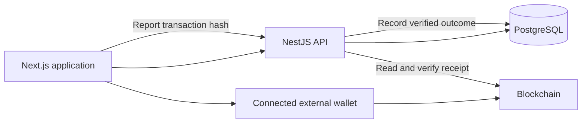

# System Architecture

See [Runtime Architecture Boundaries](runtime-boundaries.md) for the Phase 1
source map, exact stable VPS recovery references, future runtime adapter
responsibilities and shared test strategy. The current deployment and behavior
described below remain unchanged.

## Deployment

| Component | Production deployment | Responsibility |
| --- | --- | --- |
| Next.js frontend | Vercel, at `app.wizpay.xyz` | Payment UI, external-wallet connection, signing, and progress display |
| NestJS backend | Docker on the VPS | Request validation, capability checks, intent storage, and receipt verification |
| PostgreSQL 15 | Docker on the VPS | Wallet sessions, intents, tasks, invoices, bridge state, and activity |
| Redis 7 | Docker on the VPS | Existing BullMQ queue infrastructure |
| Arc Mainnet and external services | External infrastructure | Settlement, chain reads, and route-specific verification |

The production backend stack is defined in `deploy/arc-mainnet/compose.yml`. Frontend configuration selects its backend with `NEXT_PUBLIC_API_URL`.

## HTTP runtime composition (Phase 3)

[createWizPayApplication](../apps/backend/src/application.ts) constructs the
shared Express/Nest application and applies the existing network/configuration
validation and CORS policy. Both modes retain `AppModule`'s controllers,
authentication, local validation and global exception filter.
[main.ts](../apps/backend/src/main.ts) owns shutdown hooks and `app.listen()`
for VPS/local startup. [serverless.ts](../apps/backend/src/serverless.ts)
exports a Node HTTP handler that calls `app.init()` and dispatches through the
Express adapter without listening or installing process signal handlers.

The handler creates one lazy initialization promise, shares it across concurrent
cold requests, and reuses the application and Prisma lifecycle on warm requests.
A failed initialization closes partial resources, returns a generic 503, and
clears the promise so a later request can retry. Prisma is not disconnected
after requests. Derived database/queue configuration stays in dependency
injection rather than contaminating the next initialization's environment.

`WIZPAY_RUNTIME_MODE` accepts only `server` or `serverless`; an explicit value
must match the selected entrypoint. When absent, `main.ts` selects `server` and
the handler selects `serverless`. Only server mode starts payroll, swap and
transaction-poll BullMQ consumers. Request services and lazy Redis/BullMQ queue
producers remain available in both modes. Redis/BullMQ replacement is Phase 4;
no queue migration or backend deployment is included here. Serverless requests
that enqueue work still require an existing long-lived consumer.

## Payment Flow

## Backend Responsibilities

- Capability and route checks reject unavailable operations.
- Wallet authentication verifies a one-time signed challenge and issues an account-scoped session.
- Execution intents bind immutable payment details to an operation identity.
- Payroll preparation validates batches; reporting verifies wallet-submitted results.
- Invoice APIs distinguish merchant management from public checkout and payment verification.
- Activity APIs expose account-scoped payment records.

## Queue Boundary

BullMQ workers for payroll, swap, and transaction polling remain in the backend. Their presence does not mean the backend signs or submits user payments.

The legacy payroll and swap agents reject backend submission on Arc Mainnet. Current wallet payment flows must not be described as worker-owned transfers or as automatic retries of user payments.

## Frontend Navigation

Desktop navigation contains Home, Send, Payroll, Invoices, and Swap & Bridge. Mobile navigation contains Home, Actions, Swap, and Account. Assets are accessible from Home; the Account menu opens the profile page.

PWA installation is offered when supported by the device and browser. The service worker does not provide offline payment execution.

## Trust Boundaries

User input, transaction hashes, and wallet claims require validation. The backend verifies receipts before accepting successful settlement. Signing authority remains in the connected wallet.

Capabilities and route readiness determine availability. Source files, menu items, and prepared calldata are not evidence that a production payment completed.
