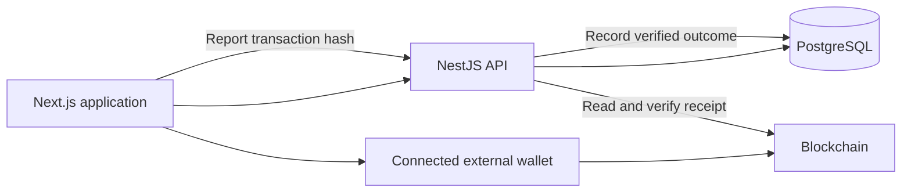

# System Architecture

## Deployment

| Component | Production deployment | Responsibility |
| --- | --- | --- |
| Next.js frontend | Vercel, at `app.wizpay.xyz` | Payment UI, external-wallet connection, signing, and progress display |
| NestJS backend | Docker on the VPS | Request validation, capability checks, intent storage, and receipt verification |
| PostgreSQL 15 | Docker on the VPS | Wallet sessions, intents, tasks, invoices, bridge state, and activity |
| Redis 7 | Docker on the VPS | Existing BullMQ queue infrastructure |
| Arc Mainnet and external services | External infrastructure | Settlement, chain reads, and route-specific verification |

The production backend stack is defined in `deploy/arc-mainnet/compose.yml`. Frontend configuration selects its backend with `NEXT_PUBLIC_API_URL`.

## Payment Flow

## Backend Responsibilities

- Capability and route checks reject unavailable operations.
- Wallet authentication verifies a one-time signed challenge and issues an account-scoped session.
- Execution intents bind immutable payment details to an operation identity.
- Payroll preparation validates batches; reporting verifies wallet-submitted results.
- Invoice APIs distinguish merchant management from public checkout and payment verification.
- Activity APIs expose account-scoped payment records.

## Queue Boundary

BullMQ workers for payroll, swap, and transaction polling remain in the backend. Their presence does not mean the backend signs or submits user payments.

The legacy payroll and swap agents reject backend submission on Arc Mainnet. Current wallet payment flows must not be described as worker-owned transfers or as automatic retries of user payments.

## Frontend Navigation

Desktop navigation contains Home, Send, Payroll, Invoices, and Swap & Bridge. Mobile navigation contains Home, Actions, Swap, and Account. Assets are accessible from Home; the Account menu opens the profile page.

PWA installation is offered when supported by the device and browser. The service worker does not provide offline payment execution.

## Trust Boundaries

User input, transaction hashes, and wallet claims require validation. The backend verifies receipts before accepting successful settlement. Signing authority remains in the connected wallet.

Capabilities and route readiness determine availability. Source files, menu items, and prepared calldata are not evidence that a production payment completed.
