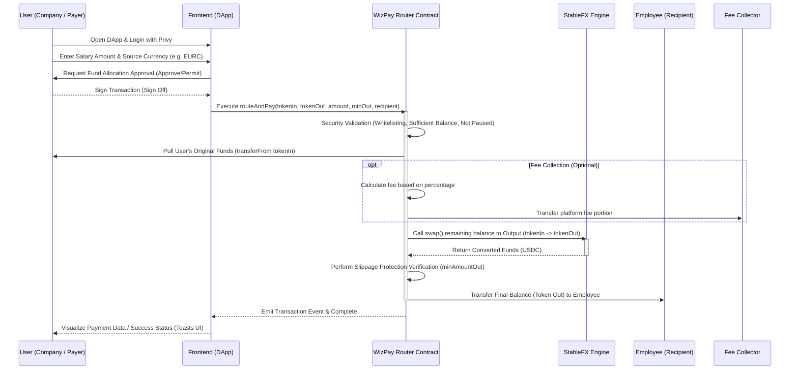

# Architecture Analysis and Workflow: WizPay (WizPay)

## 📌 Project Overview
WizPay (formerly known as WizPay) is a non-custodial Web3 *smart payment router* infrastructure operating on the ARC Layer-1 blockchain (powered by Circle). The application is specifically designed to handle automated multi-token *payroll* payments across currencies (e.g., a company pays salaries in EURC, but employees choose to receive in USDC) within a single *atomic* transaction.

The project focuses on cost efficiency (extremely low *gas fees*) by integrating native **Circle StableFX** for fair exchange rates that closely track *real-time market rates*.

---

## 🏗️ Architecture Design
The WizPay system is separated into three technical pillar layers: the Frontend as the user interface, the Backend as the off-chain relay/API service layer, and Smart Contracts as the core transaction settlement engine.

1. **Frontend Layer (Client)**
   Responsible for user interaction, premium UI/UX experience (dark theme), and Web3 wallet authentication (both *Smart Wallet* and regular *EOA*).

2. **Backend Layer (API Services)**
   The layer serving off-chain computation logic, distribution of profile/transaction information that does not need to be uploaded to the blockchain, and data synchronization/advanced REST API integration with the Circle ecosystem.

3. **Smart Contract Layer (On-Chain)**
   Consists of the main router (`WizPay.sol`) which manages fund routing and distribution logic, *platform* fee deductions, and modular interaction with the *FX Engine* (`StableFXAdapter_V2`).

---

## 🔄 Workflow Diagram

The following shows the full end-to-end workflow cycle when a company uses WizPay to make employee payments:

**Execution Characteristics:**
- All steps within the Router Contract are **Atomic**.
- If any process fails (e.g., the *Slippage* limit is exceeded during swap, or gas runs out mid-execution), then **the entire flow is reverted**. The *WizPay* contract is strictly *non-custodial*; funds are never stuck in the *Contract Address*.

---

## 🛠️ Technology Usage & Tech Stack

The WizPay application leverages an innovative ecosystem for both Web2 and Web3 development. Below are the architectural component stack details:

### 1. Frontend (Web Interface)
- **Core Framework**: `Next.js 16` with `React 19`. Leverages the latest App Router architecture for *Server-Side Rendering (SSR)* and SEO-friendly performance.
- **UI/UX Styling**: Primarily `TailwindCSS v4` for composing a premium design system. Enhanced with `shadcn/ui` and the `tailwindcss-animate` module to deliver top-tier micro-animations. The interface is crafted with a *Dynamic* and premium feel.
- **Web3 Engine**: `viem` and `wagmi` serve as the primary, minimally-*blocking* connector libraries, supporting multi-wallet and handling *Smart Contract* transaction calls/hooks.
- **Authentication (Wallets / Social)**: Powered by `@privy-io/react-auth`. Provides seamless access similar to *Web2* applications with *Web3* security.

### 2. Backend (API Layer)
- **Node Environment**: Runs services with `Express.js`, providing router flexibility and responsiveness for *API serving*.
- **Language & Type Safety**: Fully built on `TypeScript` (`tsx` for responsive local execution). Minimizes structural data weaknesses.
- **Networking**: The `axios` library is used to synchronize network requests smoothly and securely using `CORS`. Coordinates necessary API communication with third-party services or databases (*off-chain* data).

### 3. Smart Contracts (On-Chain Blockchain Execution)
- **Primary Language**: `Solidity ^0.8.20`.
- **Framework & Deployment**: Built using the `Hardhat` framework, which wraps testing, compilation (`ethers.js`), and testnet/mainnet network management efficiently.
- **Standards & Security**: Adopts the robust `OpenZeppelin Contracts v5.4.0` library. Modules such as `ReentrancyGuard`, `Ownable`, and `Pausable` actively protect corporate funds from exploitation vulnerabilities.
- **Component Integration**: A dedicated adapter embracing the real-time/mock pricing system running modularly (`StableFXAdapter` vs `MockFXEngine`).
